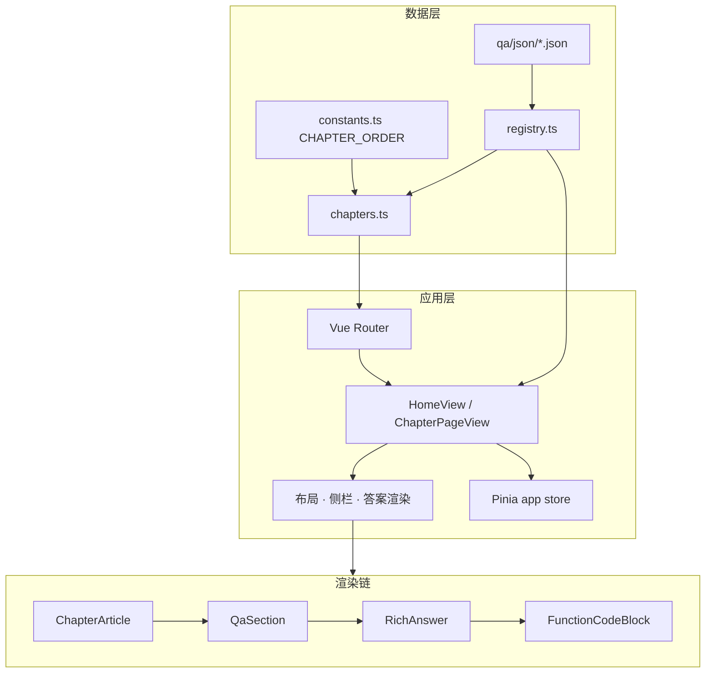

# 前端面试手册

[](https://vuejs.org/)
[](https://vite.dev/)
[](https://www.typescriptlang.org/)
[](https://pnpm.io/)
[](./LICENSE)
[](https://sowee121.github.io/frontend-interview-vue/)

**前端面试手册** — 面向前端工程师的面试题库静态站点：18 个专题章节、结构化 JSON 答案、章内目录与代码高亮，支持桌面与手机浏览器复习。内容构建时打包进前端，**无需后端**。

**在线访问**：https://sowee121.github.io/frontend-interview-vue/

## 目录

- [功能特性](#功能特性)
- [技术栈](#技术栈)
- [快速开始](#快速开始)
- [常用脚本](#常用脚本)
- [项目结构](#项目结构)
- [架构说明](#架构说明)
- [贡献指南](#贡献指南)
- [部署说明](#部署说明)
- [许可证](#许可证)

## 功能特性

| 特性 | 说明 |
|------|------|
| 18 个专题 | HTML/CSS、JavaScript、ES6、TypeScript、Vue、React、Node、小程序、浏览器、网络安全、工程化、性能、场景题、AI、Agent、Electron、项目题、编程手写题 |
| 章内目录 | 桌面端侧栏锚点 + sticky，点击跳转 `#question-id` |
| 顶栏章节导航 | 顶栏可横向滑动的章节 tabs，跨章切换 |
| 移动端 | ≤900px 隐藏侧栏；**左下** FAB 唤起底部章内目录，**右下** FAB 回到顶部 |
| 结构化答案 | `src/data/qa/json/*.json` + `RichSegment`，避免手写 HTML |
| 代码高亮 | 编程题章节使用 highlight.js |
| History 路由 | `/chapters/:slug`，链接可分享、可刷新 |

## 技术栈

| 类别 | 技术 |
|------|------|
| 框架 | Vue 3、Vue Router、Pinia |
| 构建 | Vite 8、TypeScript、`vue-tsc` |
| 样式 | Sass |
| 质量 | ESLint、Prettier、Oxlint |

## 快速开始

**环境**：Node.js `^20.19.0` 或 `>=22.12.0`，[pnpm](https://pnpm.io/) 9+

```sh
git clone https://github.com/sowee121/frontend-interview-vue.git
cd frontend-interview-vue
pnpm install
pnpm dev
```

本地开发默认根路径 [http://localhost:5174](http://localhost:5174)（与 GitHub Pages 子路径无关，便于日常改题）。

若要本地验证**与线上一致**的生产构建：

```sh
pnpm build
pnpm preview
```

预览地址一般为 `http://localhost:4173/frontend-interview-vue/`（以终端输出为准）。

## 常用脚本

| 命令 | 说明 |
|------|------|
| `pnpm dev` | 本地开发（HMR） |
| `pnpm build` | 类型检查 + 生产构建；`postbuild` 会生成 `dist/404.html`（Pages SPA 回退） |
| `pnpm preview` | 预览 `dist/` |
| `pnpm lint` | ESLint + Oxlint |
| `pnpm format` | Prettier 格式化 `src/` |
| `node scripts/lint-qa-copy.mjs` | 题库文案可读性扫描（只读，不改 JSON） |

### 内容维护脚本（`scripts/`）

| 脚本 | 说明 |
|------|------|
| `reorder-qa-chapters.mjs` | 按配置重排各章 `items` 顺序 |
| `expand-cross-topic-qa.mjs` | 向现有章追加跨专题题目（埋点、i18n、WebSocket 等） |
| `seed-agent-chapter.mjs` | 生成/更新 Agent 章 JSON |
| `split-es6-chapter.mjs` | 从 javascript 章拆出 ES6 章（一次性迁移用） |
| `lint-qa-copy.mjs` | 答案/题面文案规范扫描 |

## 项目结构

```
frontend-interview-vue/
├── .github/workflows/deploy.yml   # GitHub Pages 自动部署
├── src/
│   ├── assets/styles/           # tokens / base / layout / components
│   ├── config/site.ts           # 站点名、页脚链接（SITE_NAME 等）
│   ├── data/qa/json/            # 各章题目与答案（主要维护入口）
│   ├── data/qa/registry.ts      # 章节 JSON 静态注册
│   ├── data/constants.ts        # CHAPTER_ORDER（18 章顺序）
│   ├── components/              # 答案渲染、侧栏、FAB、页脚等
│   ├── composables/             # 路由章节数据等
│   ├── views/                   # 首页、章节页
│   └── router/                  # History 路由与锚点滚动
├── scripts/                     # 题库维护脚本（见上表）
└── dist/                        # 构建产物（已 gitignore，勿提交）
```

## 架构说明

纯静态 SPA：构建时将所有章节 JSON 打包进前端，运行时无 API 请求。

### 整体分层



| 层级 | 职责 | 关键文件 |
|------|------|----------|
| 数据 | 题目内容、章节元信息、顺序 | `src/data/qa/json/`、`registry.ts`、`constants.ts`、`chapters.ts` |
| 路由 | History 模式、无效 slug 回首页、锚点滚动、document.title | `src/router/index.ts`、`scrollBehavior.ts`、`setupRouterGuards.ts` |
| 页面 | 首页目录 / 章节阅读壳层 | `HomeView.vue`、`ChapterPageView.vue` |
| 组件 | 布局、导航、答案渲染 | `ChapterLayout`、`ChapterSidebar`、`ChapterTocMobile`、`ScrollToTopFab`、`HeaderChapterTabs`、`QaSection`、`RichAnswer` |
| 配置 | 站点展示名、页脚外链 | `src/config/site.ts` |
| 状态 | 站点名、最近访问章节（可扩展） | `src/stores/app.ts`（`siteTitle` 来自 `SITE_NAME`） |
| 样式 | 全局 BEM + Sass partial | `main.scss` → `_tokens` / `_base`（`:where` 元素重置）/ `_layout` / `_components` |

### 内容数据流

1. 维护者编辑 `src/data/qa/json/<slug>.json`，每题含 `id`、`navLabel`、`question`、`answer`（`RichSegment[][]`）。
2. `registry.ts` 静态 import 各 JSON，导出 `chapterPayloads`。
3. `chapters.ts` 按 `CHAPTER_ORDER` 生成首页卡片用的 `ChapterDef`（含 TOC 列表）。
4. 章节页通过 `useChapterFromRoute()` 从路由 `slug` 取 `payload` 与 `chapter` 元数据。

答案不使用 HTML 字符串，而是 `RichSegment` 片段（`text` / `strong` / `code`），由 `RichAnswer` 逐段渲染；编程题章节（`coding`）对单段函数代码启用 `FunctionCodeBlock` + highlight.js。

### 页面结构

**首页**（`/`）

```
SiteHeader（顶栏 + 章节 tabs）
└── layout-home
    └── article
        ├── h1 目录
        ├── 导语
        └── ChapterCard 网格
SiteFooter
```

**章节页**（`/chapters/:slug`）

```
SiteHeader
└── ChapterLayout（grid：侧栏 + 主内容）
    ├── ChapterSidebar（桌面 TOC，sticky 吸顶）
    └── layout__content
        ├── 返回链接
        └── ArticleShell → ChapterArticle → QaSection × N
ChapterTocMobile（左下目录 FAB + 底部 sheet）
ScrollToTopFab（右下，滚动过 1/3 行程后显示）
SiteFooter
```

### 导航与滚动

- **跨章**：顶栏 `HeaderChapterTabs` 或首页卡片，`RouterLink` 跳转 `/chapters/:slug`。
- **章内**：TOC 链接带 hash（`#question-id`），当前项与地址栏 hash 一致时高亮。
- **锚点偏移**：`scrollBehavior` 读取 `--anchor-scroll-margin`（由 `SiteHeader` 根据顶栏高度写入），避免标题被 sticky 顶栏遮挡。
- **响应式**：宽度 ≤900px 隐藏桌面侧栏，改用 `ChapterTocMobile`；顶栏 tabs 可横向滑动并带渐隐提示。

### 构建与部署

Vite 构建产物为纯静态文件；GitHub Pages 以 `/frontend-interview-vue/` 为 `base`，`postbuild` 生成 `404.html` 实现 History 路由回退。本地 `pnpm dev` 使用 `/` 根路径，便于开发。

## 贡献指南

欢迎通过 Issue / PR 补充或订正题目。

1. Fork 本仓库，创建分支（如 `feat/add-vue-question`）。
2. 编辑 `src/data/qa/json/<slug>.json`（`slug` 见 [`src/data/constants.ts`](src/data/constants.ts)）。
3. `pnpm dev` 本地预览，`pnpm build` 确保通过。
4. 提交 PR，简要说明知识点与改动原因。

字段定义见 [`src/types/qa-content.ts`](src/types/qa-content.ts)（`QaItem`、`RichSegment` 等）。

**文案规范**：维护 `answer`、`questionNote` 及章节 `lead`/`description` 时请遵循 [`docs/answer-style-guide.md`](docs/answer-style-guide.md)（面向约 5 年经验、缩写首处带中文释义）。提交前可运行 `node scripts/lint-qa-copy.mjs` 做可读性扫描。

```sh
node scripts/reorder-qa-chapters.mjs   # 重排题目顺序
node scripts/lint-qa-copy.mjs          # 文案扫描
```

**维护建议**：答案宜「短问短答、可验证」；代码示例优先最小可复现片段。仅改单题文案时无需改 README；**增删章节**或调整 `CHAPTER_ORDER` 时请同步 `registry.ts`、README「功能特性」与 `.cursor/rules/00-project-core.mdc` 中的章节说明。

**样式约定**（详见 [`src/assets/main.scss`](src/assets/main.scss) 顶部注释与 [`.cursor/rules/30-scss-and-build.mdc`](.cursor/rules/30-scss-and-build.mdc)）：

- BEM：块 `{domain}-{name}`、元素 `{block}__{part}`、修饰符 `{block}--{variant}`
- 元素重置在 `_base.scss`（`:where()`，特异性为 0）；布局/导航 `_layout.scss`，内容卡片 `_components.scss`
- 块样式以 `.site-footer` 这类**类选择器为根**，避免 `footer { &.site-footer { &__line } }` 编译成错误选择器

## 部署说明

### GitHub Pages（当前方案）

| 项 | 说明 |
|----|------|
| 访问地址 | https://sowee121.github.io/frontend-interview-vue/ |
| 触发方式 | 推送到 `main` 分支，由 [deploy.yml](.github/workflows/deploy.yml) 自动构建部署 |
| 仓库设置 | Settings → Pages → Source 选择 **GitHub Actions** |
| 子路径 | 生产构建 `base` 为 `/frontend-interview-vue/`（见 [`vite.config.ts`](vite.config.ts)） |
| History 回退 | `pnpm build` 后 `postbuild` 复制 `index.html` → `404.html`，支持深链刷新 |

> 分享根地址时，GitHub 可能将无末尾 `/` 的 URL 重定向到带 `/` 的形式，属托管平台默认行为，不影响使用。

### 其他静态托管

产物目录为 `dist/`，亦可部署到 Cloudflare Pages、Vercel 等。需满足：

- 构建命令：`pnpm install && pnpm build`
- 输出目录：`dist`
- History 模式：未知路径回退到 `index.html`（或等效 SPA 规则）
- 若部署在子路径，需同步修改 Vite `base` 与路由 `import.meta.env.BASE_URL`

## 相关链接

- [Vue 3](https://vuejs.org/) · [Vite](https://vite.dev/) · [Vue Router](https://router.vuejs.org/)
- 推荐 IDE：[VS Code](https://code.visualstudio.com/) + [Vue - Official (Volar)](https://marketplace.visualstudio.com/items?itemName=Vue.volar)

## 许可证

本项目采用 [MIT License](./LICENSE) 开源。若对你有帮助，欢迎 Star 或提交 PR。
